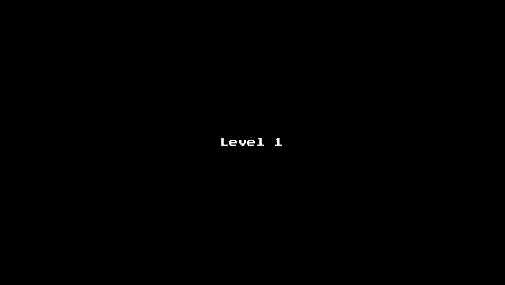

# WriteRight
Further exploration of unity game engine. 

# Game Description
Game's objective is to type the word above the enemy head before the enemy reaches the player who is located in the middle. The level ends when a certain number of enemies are defeated, and the game ends when you've defeated level 5.

# Game Preview
Preview of the Menu

Preview of the Game level

# Credits
Game Art - Ansimuz: https://assetstore.unity.com/packages/2d/characters/gothicvania-cemetery-120509

Word List - https://github.com/first20hours/google-10000-english

# TODO

Check words to make sure they only have normal letters else skip, ignore lines that start with //

Return to menu with error message if no words are valid

Pull words from another path (dictionary, etc) entered by the user has to end with .txt, if none then default to local txt

Change spawns to only appear near left and right side, not top and bottom (too close)

Create different enemy types, spawn based on level

When enemies share word, destroy the closest
